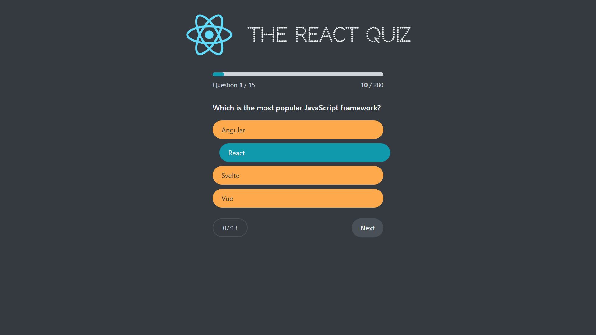

# The React Quiz

## Description

This is a simple quiz app built with React. It uses the question from the `data` folder that is served by the `json-server` package.



## Installation

```bash
npm install
```

## Usage

Start the json-server

```bash
npm run server
```

Start the app

```bash
npm start
```
